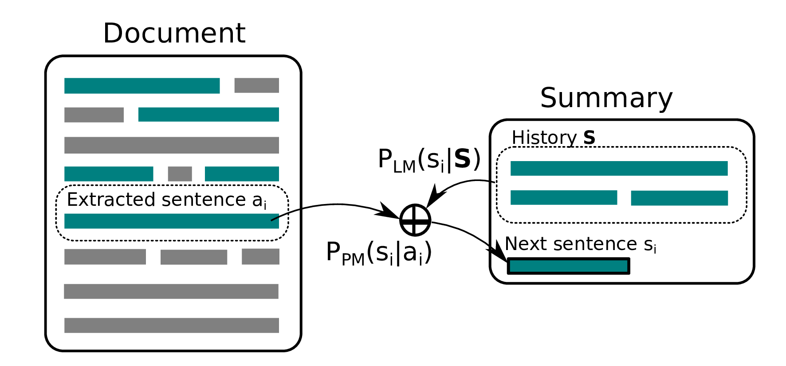
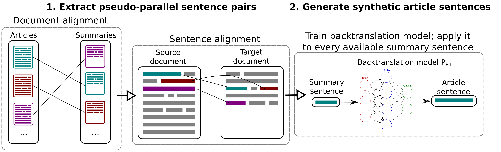

*Resources for the paper '[Abstractive Document Summarization Without Parallel Data](https://arxiv.org/abs/1907.12951)'.* 



# Datasets 

We provide the following datasets: 
 * The CNN/DailyMail parallel summarization dataset we use in the paper. 
 Our processed version is available [here](https://drive.google.com/file/d/10qeztf26eVxmHzUX2JwvC3E0F0BsWcg2/view?usp=sharing). 
 * Our dataset of the plain text of 350k press releases, scraped from [EurekAlert](https://www.eurekalert.org/), 
 can be downloaded from [here](https://drive.google.com/file/d/1wNFacsOfgyVbUiWaRHFOCCba2OmDeTQg/view?usp=sharing). 
 Thanks to [EurekAlert](https://www.eurekalert.org/) for allowing us to share it. 
 * Our testing dataset for the scientific summarization task ...(to be added, waiting for permission)... 
 <!---
 The dataset contains 6821 parallel pairs of the full text of scientific articles and their press releases.
 The press releases come from [EurekAlert](https://www.eurekalert.org/), while the papers come 
 from the [ScienceDirect API](https://www.elsevier.com/solutions/sciencedirect/support/api). -->   

# Dependencies 

This code base comes with a modified old version of [Fairseq](https://github.com/pytorch/fairseq), 
as well as with snapshots of the [subword-nmt](https://github.com/rsennrich/subword-nmt), [METEOR](https://github.com/cmu-mtlab/meteor)
and ROUGE repositories. 

To install all project dependencies, you can run `pip install -r requirements.txt`. You'll also 
need to install our Fairseq version, which might also require downgrading PyTorch, 
depending future compatibility. 

# Running the system

The pipeline for training the sentence paraphrasing model consists of two components: 
a **sentence extractor**, which selects salient sentences from the article, and a **sentence abstractor**, 
which paraphrases each of the extracted sentences:  



We have implemented two sentence extractors: Lead, which picks the first sentences from 
the article, and LexRank. 

## Extracting pseudo-parallel data 

Follow the instructions from [this repository](https://github.com/ninikolov/lha) 
to extract pseudo-parallel data from your raw datasets. 

## Training a backtranslation model on the sentence level 

Given a pseudo-parallel dataset which contains files that follow the naming convention: 
`train.article.clean`, `train.summary.clean`, `valid.article.clean`, `valid.summary.clean`, `test.article.clean`, `test.summary.clean`
(where each file contains one *sentence* per line)

You can train a backtranslation model on your pseudo-parallel sentences using the 
following commands: 

```
# Define the path to the BPE and Fairseq dictionaries you will use. 
# If you don't provide them, they will be learned from the data automatically. 
export BPE_DICT=~/nikola/joint/joint50k.bpe
export FAIRSEQ_DICT=~/nikola/joint/data/dict.clean.txt
# Start the pipeline
bash train_pipeline/base_pipeline.sh 1 summary article true true lstm_tiny $BPE_DICT $BPE_DICT $FAIRSEQ_DICT $FAIRSEQ_DICT
```

where the model will use all train/validation/testing files that contain `summary` as the source datasets, and all
files that contain `article` as the target datasets here. 
The command will take care of dataset preparation, conversion to BPE and training. Read
the scripts for more info on the specific commands. The script is using 
the [fairseq](https://github.com/pytorch/fairseq) library for training. 

## Generating synthetic sentences using the backtranslation model

Once the backtranslation model is trained, you can use it to synthesize additional 
source sentences. This can be done using the following script: 

```
bash main/backtranslate_summary_sentences.sh target_sentences 2
```

The script expects the input file `target_sentences` to contain one sentence per line. 
By default, one sentence will be generated for each of the sentences.   

## Training the final sentence paraphrasing model 

Once you have all your data prepared and combined into a single dataset
(also using the naming convention `train.article.clean`, `train.summary.clean`, `valid.article.clean`, `valid.summary.clean`, `test.article.clean`, `test.summary.clean`), 
you can train your final sentence paraphrasing model using 
the same training script, but by setting the source and target datasets to be your 
datasets of `article` and `summary` sentences: 

```
bash train_pipeline/base_pipeline.sh 1 article summary true true lstm_tiny $BPE_DICT $BPE_DICT $FAIRSEQ_DICT $FAIRSEQ_DICT
```

## Running the whole system   

Once the final paraphrasing model is trained, you can run the whole extractive-abstractive 
pipeline using the following command: 

```
bash main/inference_pipeline.sh valid.paper.clean 2 10 lead
```

The above will first apply the Lead extractor to your article, and will then
paraphrase each of the extracted sentences using your previously trained 
paraphrasing model. 
You'll need to modify some of the variables in the `inference_pipeline.sh` script 
to make it point to the correct model/vocabulary files of your paraphrasing model. 

# Citation 

```
@InProceedings{nikolov2020abstractive,
  author = {Nikola I. Nikolov and Richard Hahnloser},
  title = {Abstractive Document Summarization without Parallel Data},
  booktitle = {Proceedings of the Twelfth International Conference on Language Resources and Evaluation (LREC 2020)},
  year = {2020},
  month = {may},
  date = {11-16},
  location = {Marseille, France},
  editor = {},
  publisher = {European Language Resources Association (ELRA)},
  address = {Paris, France},
  language = {english}
  }
```